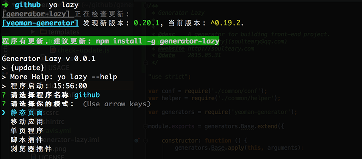

## Generator Lazy

[](https://travis-ci.org/soulteary/generator-lazy)
[](https://coveralls.io/r/soulteary/generator-lazy)
[](https://david-dm.org/soulteary/generator-lazy)
[](https://david-dm.org/soulteary/generator-lazy#info=devDependencies)
[](http://badge.fury.io/js/generator-lazy)


[](README.md)

    懒人该使用的项目创建方式。

## Preview

[](README.md)

## 支持项目类型

- [x] 静态页面
- [ ] 移动应用
- [ ] 单页程序
- [ ] 脚本插件
- [ ] 浏览器插件

## 模块功能

- [x] 工具自带检查更新机制，提示工具极其相关依赖更新，使工具保持生命力。
- [x] 支持在项目中添加常见协议，并更新README.md文档。
- [x] 创建项目时，自动添加项目结构到README.md文档。
- [x] 根据配置文件或者构建命令一键构建项目目录结构和初始文件。
- [ ] 选择具体的构建方案。
  - [x] 构建静态页面/网站。
  - [ ] 构建移动应用。
  - [ ] 构建单页程序。
  - [ ] 构建脚本插件。
  - [ ] 构建浏览器插件。
- [ ] 选择CSS预编译器方案
  - [ ] 选择SASS。
  - [x] 选择LESS。
- [ ] 选择JS模块化方案
  - [ ] AMD/CMD/UMD。
  - [x] CommonJS。
- [ ] 选择JS模板方案
  - [x] doT。
  - [ ] lodash。
  - [ ] Mustcache。
- [ ] 选择测试框架方案
- [ ] 动态更新 && 预览方案

## 安装使用

如果你足够懒，那么可以这样。

```
npm install -g generator-lazy
```

当然也可以这样...

```
git clone https://github.com/soulteary/generator-lazy.git
cd generator-lazy
npm link
```

## 使用方法

- 在你想创建项目的目录中，执行```yo lazy```，进入向导模式，手牵手一步一步向前走，:D
- [使用配置命令构建项目](./doc/Use-with-configure.md)
- [使用配置文件构建项目](./doc/Use-with-config-file.md)

## DEMO

- [使用DEMO来玩一下](https://github.com/soulteary/generator-lazy-demo)

## 编辑器插件

<table>
  <tr>
    <td align="center">
      <a target="_blank" href="https://github.com/editorconfig/editorconfig-jetbrains#readme">
        
        <div>AppCode</div>
      </a>
    </td>
    <td align="center">
      <a target="_blank" href="https://github.com/sindresorhus/atom-editorconfig#readme">
        
        <div>Atom</div>
      </a>
    </td>
    <td align="center">
      <a target="_blank" href="https://github.com/kidwm/brackets-editorconfig/">
        
        <div>Brackets</div>
      </a>
    </td>
    <td align="center">
      <a target="_blank" href="https://github.com/editorconfig/editorconfig-codeblocks#readme">
        
        <div>Code::Block</div>
      </a>
    </td>
  </tr>

  <tr>
    <td align="center">
      <a target="_blank" href="https://github.com/editorconfig/editorconfig-emacs#readme">
        
        <div>Emacs</div>
      </a>
    </td>
    <td align="center">
      <a target="_blank" href="https://github.com/editorconfig/editorconfig-geany#readme">
        
      <div>Geany</div>
      </a>
    </td>
    <td align="center">
      <a target="_blank" href="https://github.com/editorconfig/editorconfig-gedit#readme">
        
        <div>Gedit</div>
      </a>
    </td>
    <td align="center">
      <a target="_blank" href="https://github.com/RReverser/github-editorconfig#readme">
        
        <div>GitHub</div>
      </a>
    </td>
  </tr>

  <tr>
    <td align="center">
      <a target="_blank" href="https://github.com/editorconfig/editorconfig-jetbrains#readme">
        
        <div>inteltdJ</div>
      </a>
    </td>
    <td align="center">
      <a target="_blank" href="https://github.com/editorconfig/editorconfig-jedit#readme">
        
        <div>jEdit</div>
      </a>
    </td>
    <td align="center">
      <a target="_blank" href="https://github.com/editorconfig/editorconfig-notepad-plus-plus#readme">
        
        <div>Notepad++</div>
      </a>
    </td>
    <td align="center">
      <a target="_blank" href="https://github.com/editorconfig/editorconfig-jetbrains#readme">
        
        <div>PHPStorm</div>
      </a>
    </td>
  </tr>

  <tr>
    <td align="center">
      <a target="_blank" href="https://github.com/editorconfig/editorconfig-jetbrains#readme">
        
        <div>PyCharm</div>
      </a>
    </td>
    <td align="center">
      <a target="_blank" href="https://github.com/editorconfig/editorconfig-jetbrains#readme">
        
        <div>RubyMine</div>
      </a>
    </td>
    <td align="center">
      <a target="_blank" href="https://github.com/sindresorhus/editorconfig-sublime#readme">
        
        <div>Subtdme Text</div>
      </a>
    </td>
    <td align="center">
      <a target="_blank" href="https://github.com/Mr0grog/editorconfig-textmate#readme">
        
        <div>TextMate</div>
      </a>
    </td>
  </tr>

  <tr>
    <td align="center">
      <a target="_blank" href="https://github.com/editorconfig/editorconfig-vim#readme">
        
        <div>Vim</div>
      </a>
    </td>
    <td align="center">
      <a target="_blank" href="https://github.com/editorconfig/editorconfig-visualstudio#readme">
        
        <div>Visual Studio</div>
      </a>
    </td>
    <td align="center">
      <a target="_blank" href="https://github.com/editorconfig/editorconfig-jetbrains#readme">
        
        <div>WebStorm</div>
      </a>
    </td>
  </tr>
</table>

[扩展阅读 - CSS 创作指南（Beta）](https://github.com/cssdream/css-creating/blob/master/README.md)


## 其他

本着```不拒绝(PR)、不承诺(RELEASE)、不负责(BUGFIX)```的三不精神，挖坑待填。
